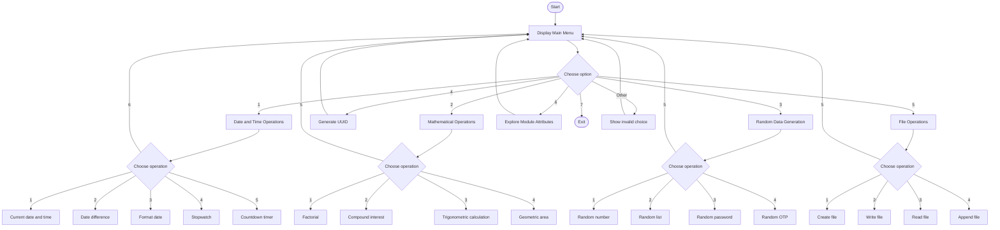

# 🧰 Multi-Utility Toolkit


> A menu-driven Python toolkit that brings several small utilities together in one command-line application.

## ✨ What this project does

The **Multi-Utility Toolkit** provides a single interactive menu for working with:

1. 📅 Date and time operations
2. 🧮 Mathematical operations
3. 🎲 Random data generation
4. 🆔 UUID generation
5. 📁 File operations through a custom `file` module
6. 🔎 Module attribute exploration with `dir()`
7. 🚪 Exit

The main program uses separate functions for the different utility groups and repeatedly returns to the main menu until the user exits.

## 🗂️ Main features

### 📅 Date and Time Operations

The toolkit includes:

- Displaying the current date and time
- Finding the difference between two dates
- Formatting the current date
- A simple stopwatch style loop
- A countdown timer
- Returning to the main menu

Example flow:

```text
Date and Time Operations
        │
        ├── Current date/time
        ├── Date difference
        ├── Custom date format
        ├── Stopwatch
        └── Countdown timer
```

### 🧮 Mathematical Operations

The mathematical menu contains:

- Factorial calculation
- Compound interest calculation
- Trigonometric calculations
- Area calculation for a geometric shape

### 🎲 Random Data Generation

The random data menu provides:

- Random number generation
- Random list shuffling
- Random password generation
- Random OTP generation

### 🆔 UUID Generation

The main menu can generate a UUID using Python's `uuid.uuid4()`.

### 📁 File Operations

File operations are delegated to a custom module named `file`.

The menu supports:

- Creating a new file
- Writing to a file
- Reading from a file
- Appending to a file

The screenshots show an example using `example.txt`.

### 🔎 Module Attribute Exploration

The project also demonstrates Python's `dir()` functionality by asking for a module name and displaying available attributes.

## 🔀 Project Flowchart



## 🧭 Simplified Architecture

```text
                    ┌──────────────────────────┐
                    │   Multi-Utility Toolkit  │
                    └────────────┬─────────────┘
                                 │
              ┌──────────────────┼──────────────────┐
              │                  │                  │
        Date & Time          Mathematics       Random Data
              │                  │                  │
       ┌──────┼──────┐     ┌─────┼─────┐      ┌─────┼─────┐
       │      │      │     │     │     │      │     │     │
     Date   Diff   Timer  Fact. Interest Trig  Number List Password
              │
              └──────────────┬─────────────────────┐
                             │                     │
                           UUID              File Operations
                             │                     │
                             └──────────┬──────────┘
                                        │
                                  Module Explorer
```

## 🛠️ Technologies used

- **Python**
- `datetime`
- `time`
- `math`
- `random`
- `uuid`
- A custom `file` module

The source code uses Python `match` / `case` statements for menu selection.

## 📂 Project structure

```text
multi-utility-toolkit/
│
├── Moduler_Packager.py
├── README.md
└── screenshots/
    ├── screen-01.png
    ├── screen-02.png
    ├── screen-03.png
    ├── screen-04.png
    ├── screen-05.png
    ├── screen-06.png
    ├── screen-07.png
    └── screen-08.png
```

> **Important:** The file-operation section imports a custom module named `file`. If you want those operations to run outside the demonstrated environment, make sure the project's `file.py` module is present in the same Python project directory.

## ▶️ How to run

1. Install Python 3.x.
2. Put `Moduler_Packager.py` and the required custom `file.py` module in the same project directory.
3. Open a terminal in the project directory.
4. Run:

```bash
python Moduler_Packager.py
```

5. Select a number from the main menu and follow the prompts.

## 🧪 Example usage shown in the screenshots

The provided run demonstrates:

- Current date and time display
- A 10-day date difference between `2024-12-25` and `2025-01-04`
- Factorial of `5`, producing `120`
- A compound interest calculation using principal `1000`, rate `5`, and time `2`
- Random password generation with length `8`
- UUID generation
- Creating `example.txt`
- Writing `This is a sample file.`
- Reading the sample file
- Exploring attributes with `dir()`
- Handling an invalid menu choice such as `8`

## 🖼️ Screenshots

### 1. Date and Time Operations


### 2. Date Difference


### 3. Mathematical Operations


### 4. Random Data Generation


### 5. UUID and Main Menu


### 6. File Creation and Writing


### 7. File Reading and Main Menu


### 8. Module Attribute Exploration and Exit


## ⚠️ Notes about the current implementation

This README documents the behavior shown by the supplied source code and screenshots.

A few implementation details are worth knowing:

- The compound interest section uses a custom calculation based on the entered rate and time.
- The trigonometric example passes `30` and `45` directly to `math.sin()` and `math.cos()`, which use radians.
- The random password is built from a fixed character list and uses `random.sample()`.
- The OTP example prints four random digits individually.
- The file operations depend on the separate custom `file` module.
- The module exploration function asks for a module name, but the current implementation uses `dir(m.__doc__)`, so it does not actually import the module entered by the user.
- The main menu treats any value other than `1` through `7` as invalid.

These points are documented as observations of the supplied implementation, not as changes to the original code.

## 💡 Possible future improvements

- Add input validation so non-numeric input does not terminate the program.
- Improve the stopwatch with proper start, stop, and reset state handling.
- Allow the user to choose OTP length.
- Generate passwords from configurable character sets.
- Use a clearer compound interest formula with selectable compounding frequency.
- Convert trigonometric input from degrees to radians when users enter degrees.
- Make the module explorer actually import and inspect the module entered by the user.
- Add automated tests for each utility.
- Add a `requirements.txt` only if external dependencies are introduced.

## 📜 License

No license was supplied with the project files. Add the license you intend to use before publishing the project publicly.

## 👨‍💻 Project

**Multi-Utility Toolkit**

A compact Python practice project demonstrating functions, loops, `match` / `case`, standard library modules, random data generation, UUIDs, file handling, and module introspection.
